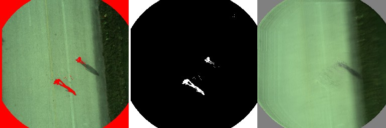

## Telemetry assisted frame registration and background subtraction in low-altitude UAV videos

**************************************
To start the demo of foreground segmention for UAV videos run the file "UAV_bckggd_demo.m"

to test the registration methods and plot the results for MSSIMS and PSNR metrics run the file "test_registration_methods.m" Install vlfeat library to run the test.

*****************************************
Reference:

G. Tzanidou P. Climent-Perez, G. Hummel, M. Schmitt, P.  Stutz, D. Monekosso,  P. Remagnino "Telemetry assisted 
frame registration and background subtraction in low-altitude UAV videos",  accepted for publication in AVSS 2015
conference proceedings. 

*****************************************
COPYRIGHT

The source files is the copyright property of the Kingston University ('The University ')

Permission to use, copy, modify, and distribute this source file for
educational, research, and not-for-profit purposes, without fee and
without a signed licensing agreement, is hereby granted, provided that
the above copyright notice, this paragraph and the following three
paragraphs appear in all copies, modifications, and distributions.

In no event shall The University be liable to any party for direct,
indirect, special, incidental or consequential damages, including lost
profits, arising out of the use of this software and its documentation.

The software is provided without warranty. The University has no
obligation to provide maintenance, support, updates, enhancements, or
modifications.

This software was written by Giounona Tzanidou, Robot Vision Team, 
Faculty of Science, Engineering and Computing, Kingston University London
The code and use thereof should be attributed to the author where appropriate
(including demonstrations which rely on it's use).

****************************************

###### registration methods to compaire with could be
1. http://www.ee.iisc.ernet.in/new/people/faculty/soma.biswas/STIP_pdf/Res%olutionIrani.pdf
http://uk.mathworks.com/matlabcentral/fileexchange/33839-image-super-resolution-iterative-back-projection-algorithm
http://lcav.epfl.ch/software/superresolution
2. http://xanthippi.ceid.upatras.gr/people/evangelidis/george_files/PAMI_%2008.pdf
 http://uk.mathworks.com/matlabcentral/fileexchange/27253-ecc-image-%%alignment-algorithm--image-registration-
3. Robust FFT-Based Scale-Invariant Image Registration with Image Gradients
4. card features

